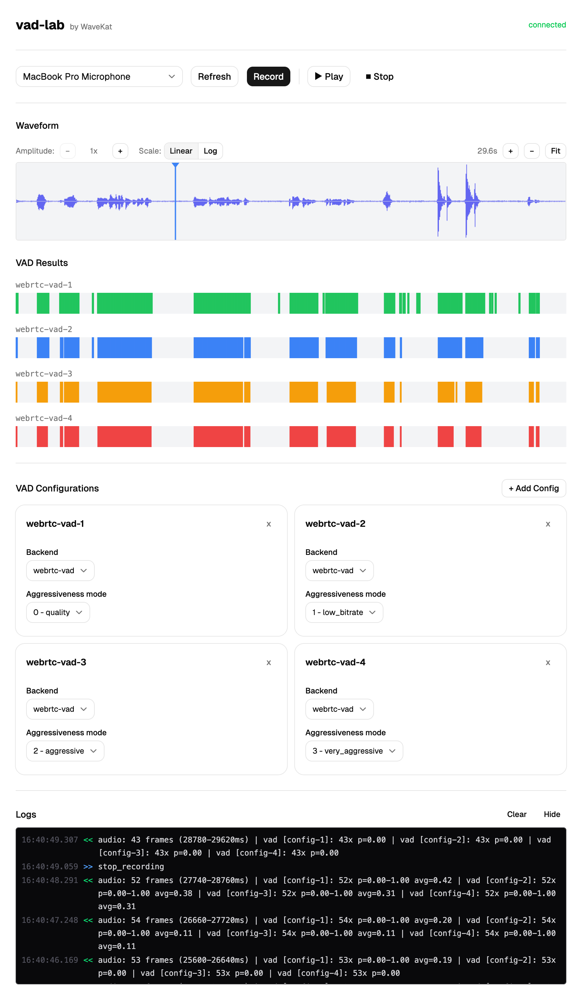

# WaveKat VAD

Voice Activity Detection library for Rust with multiple backend support.

## Usage

```rust
use wavekat_vad::VoiceActivityDetector;
use wavekat_vad::backends::webrtc::{WebRtcVad, WebRtcVadMode};

let mut vad = WebRtcVad::new(16000, WebRtcVadMode::Quality).unwrap();
let samples: Vec<i16> = vec![0; 160]; // 10ms at 16kHz
let probability = vad.process(&samples, 16000).unwrap();
```

## Backends

| Backend | Feature | Description |
|---------|---------|-------------|
| WebRTC | `webrtc` (default) | Google's WebRTC VAD - fast, binary output |
| Silero | `silero` | Neural network via ONNX - higher accuracy, continuous probability |

```toml
[dependencies]
wavekat-vad = "0.1"                    # WebRTC only
wavekat-vad = { version = "0.1", features = ["silero"] }
```

## vad-lab

Dev tool for live VAD experimentation. Captures audio server-side and streams results to a web UI.

<p align="center">
  
  <br>
  <em>vad-lab web interface</em>
</p>

### Quick Start

```sh
make setup         # Install dependencies (once)
make dev-backend   # Terminal 1
make dev-frontend  # Terminal 2
```

## License

Apache-2.0
